# Jannah Cards

A full-stack web-based invitation muslim card designer built with Laravel, Fabric.js, and TailwindCSS.  
Users can create custom wedding cards using images, text, borders, calligraphy, and more.

---
## Author
Umar S
https://github.com/UmarS689

## Why I built this

I created this project to improve my skills in PHP, Laravel, and SQL, while building something meaningful for the Muslim community. I wanted a project that wasn’t just technical practice, but something that reflected my culture and could genuinely help people design beautiful, personalised wedding invitations.
At the same time, I used this project as a platform to grow professionally. 
The features I included are all skills that employers consistently look for. Ultimately, this project was a passion project and a way to demonstrate my commitment to becoming a stronger, more well‑rounded developer.

## Future Plans
- Moving graphics and shapes.
- More formats for saving canvas files.
- External file storage system for user uploaded images. Potentially AWS
- Hosting (probably DigitalOcean)
- Payment system (presumably by API)

## Features

- Drag-and-drop card editor  
- Add images, text, borders, and decorative elements  
- Custom fonts and calligraphy  
- Real-time canvas editing with Fabric.js  
- Export final designs to pdf and submit to gallery
- Clean, modern UI  
- Dark Mode
- Mobile-friendly
- Login and registration system
- Fully functionable contact form and email system
- Custom element classes for unique elements with functioning tailored toolbars for each element
- Docker for containerisation and modern deployment workflows.
- GitHub Actions for  CI/CD pipelines
- Now introducing guest list function for you to decide who to invite to the wedding!
---

## Screenshots

### Canvas Designer
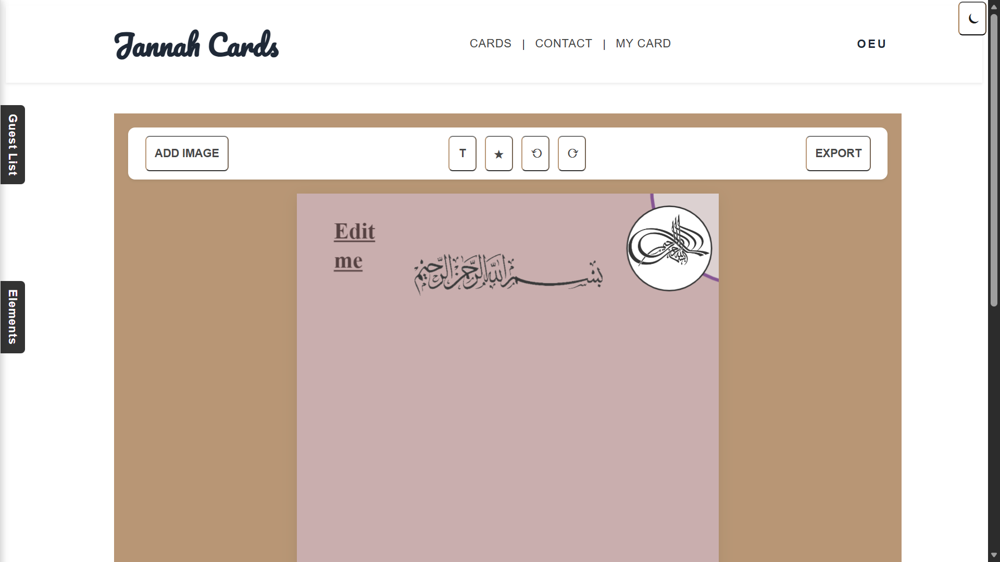
Canvas in light mode with sample elements.
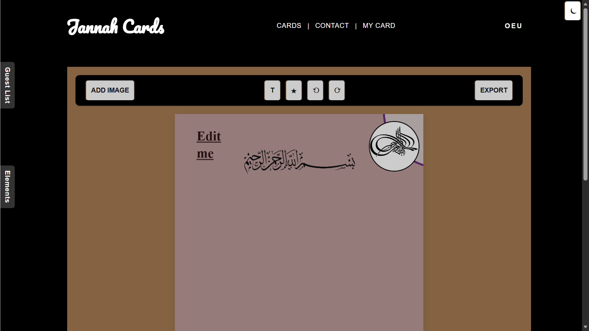
Canvas in dark mode with sample elements.
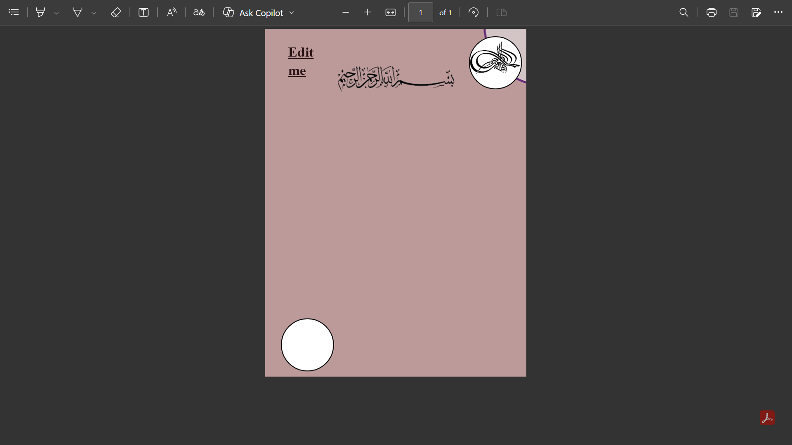
Outputted pdf file.

### Fonts
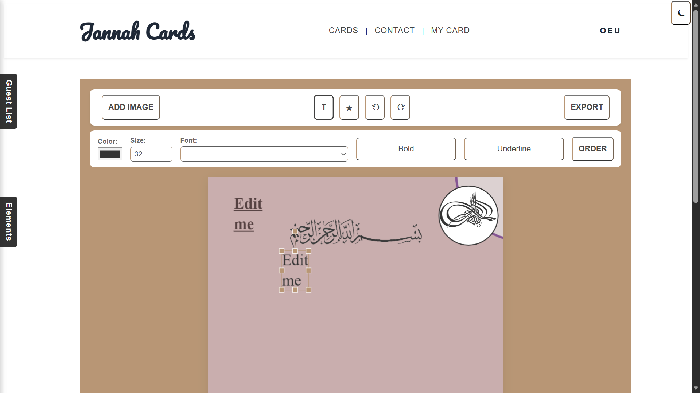
Custom toolbar for fonts.
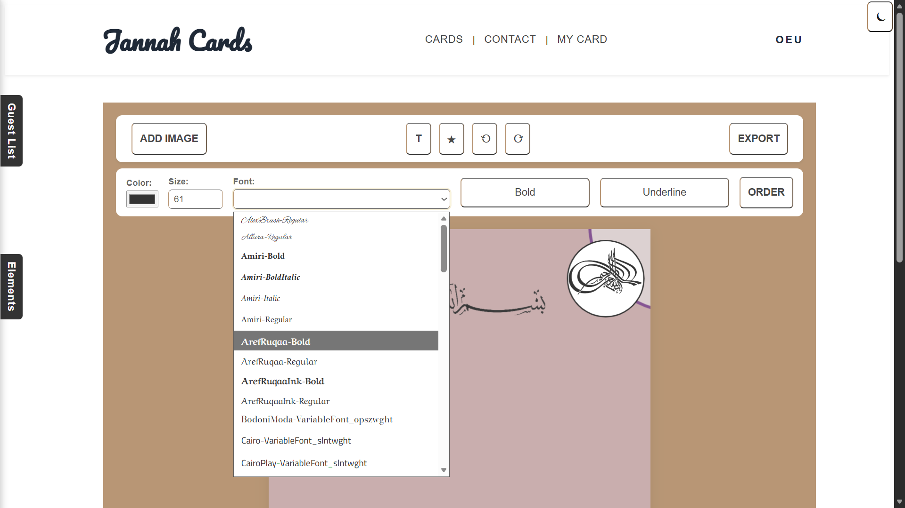
Showing all font lists (using a function which grabs all file names and then outputs and formats them).
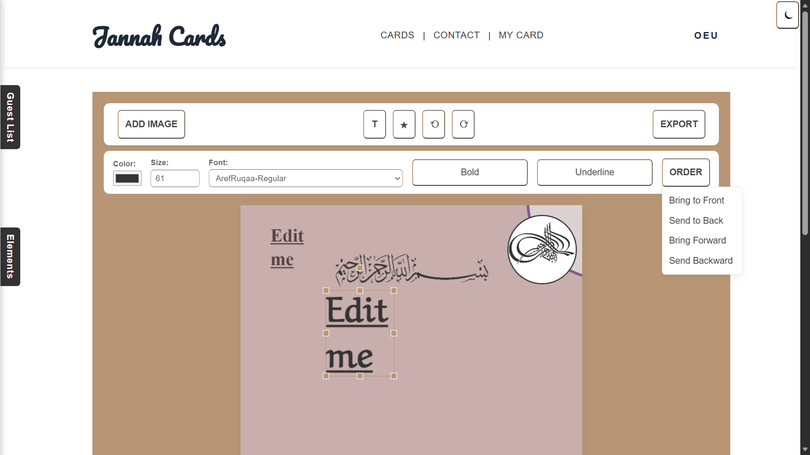
Showing the effect of using the toolbar as well as the ordering buttons.

### Mobile Friendly
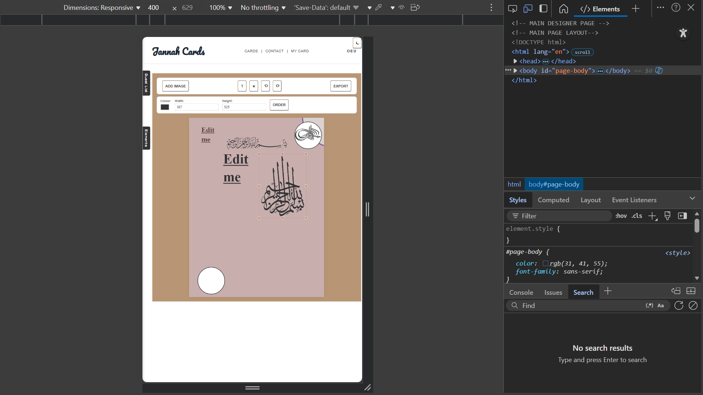
The canvas on a mobile phone.
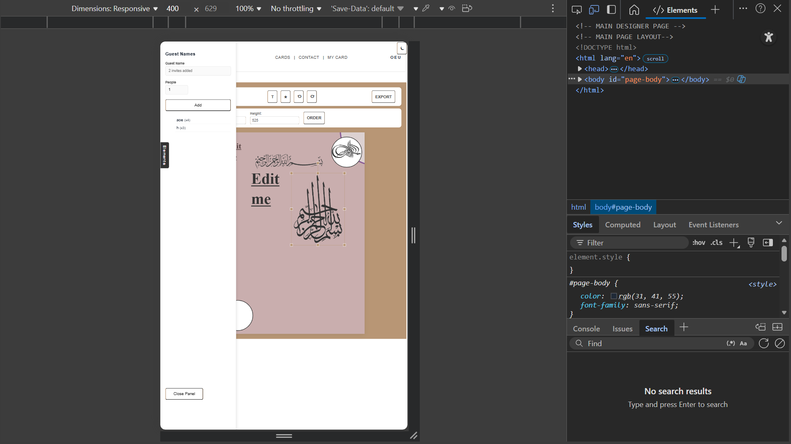
The guest list on a mobile phone.
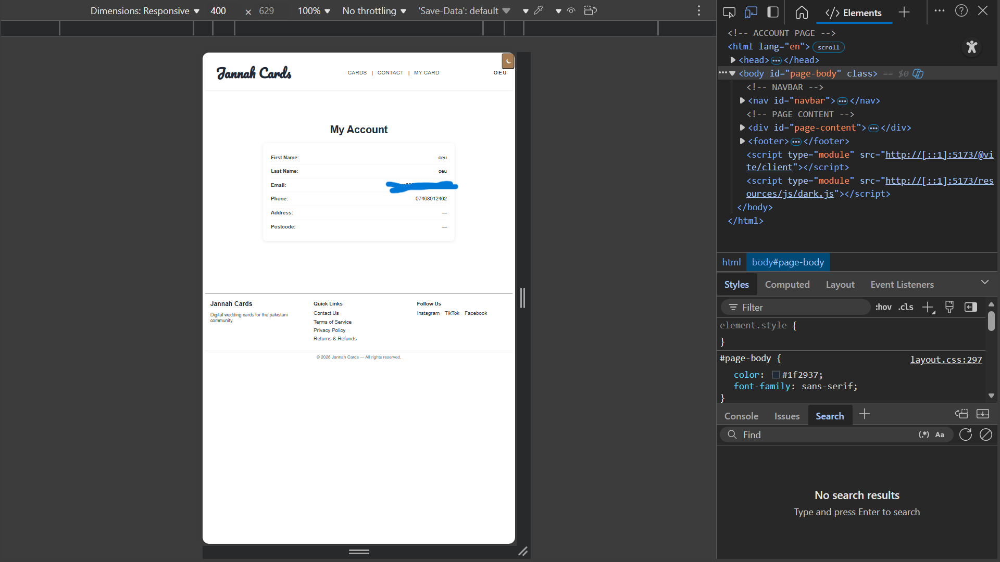
The account page on a mobile phone.

### Elements
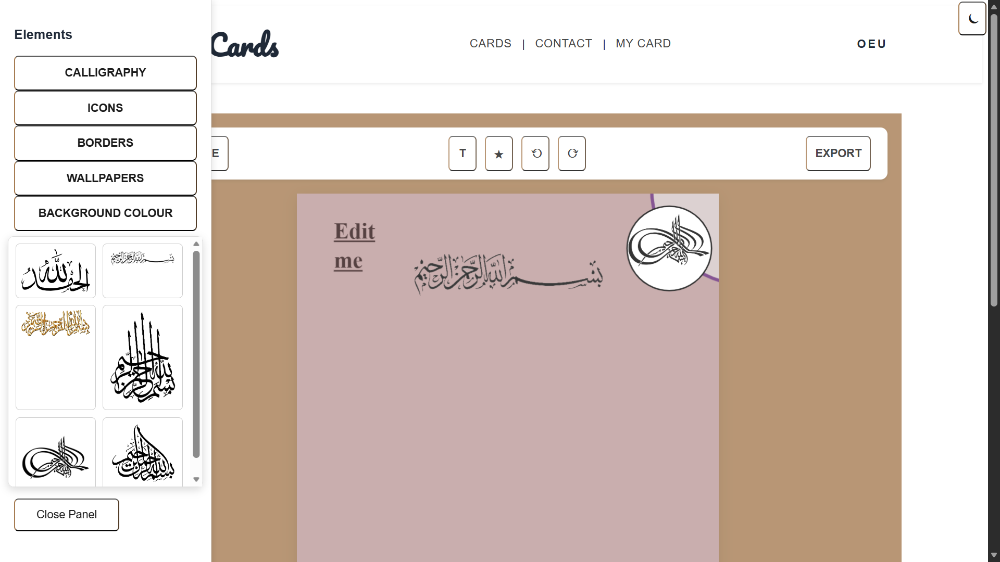
The element tab on the canvas.
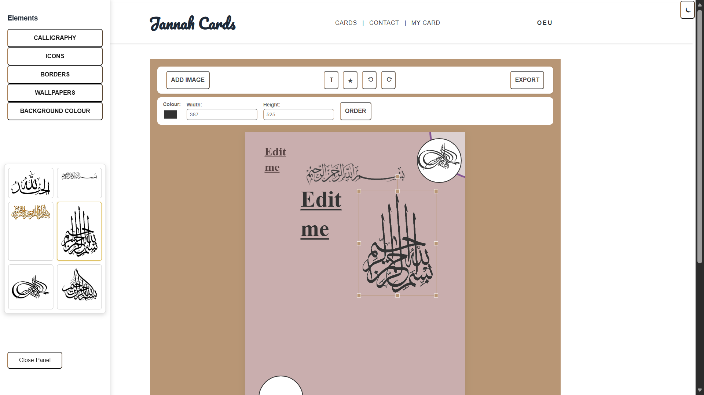
The calligraphy image on the canvas.

### Login
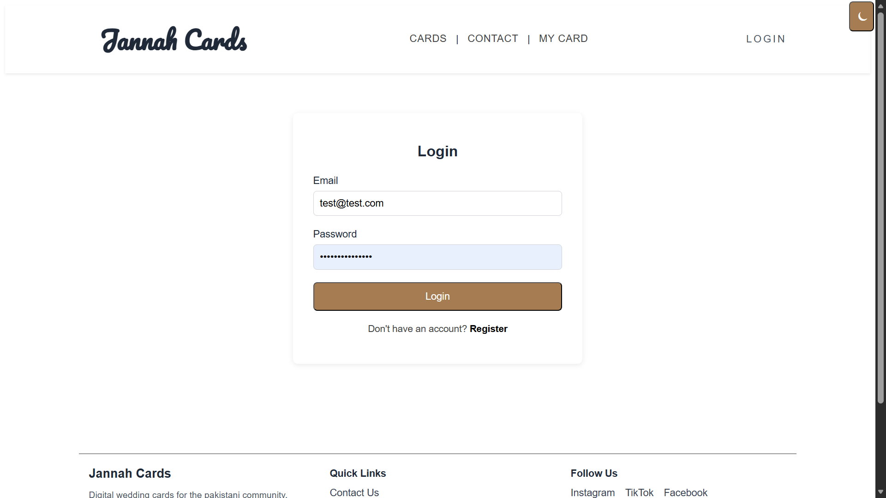
Functioning login page.
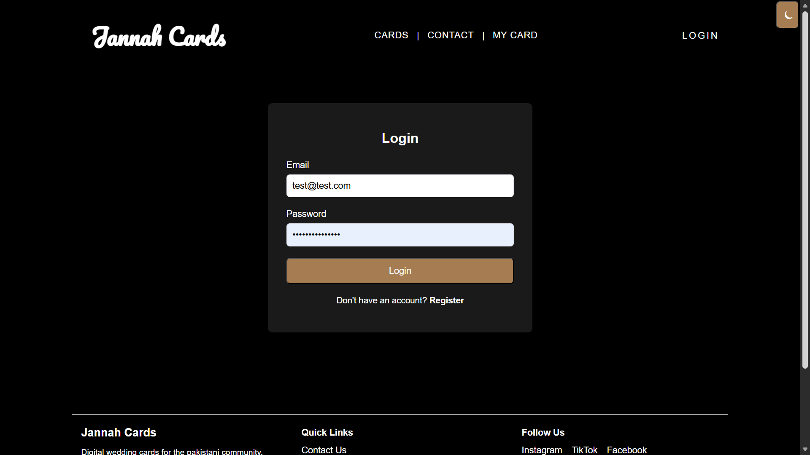
Functioning dark mode login page.
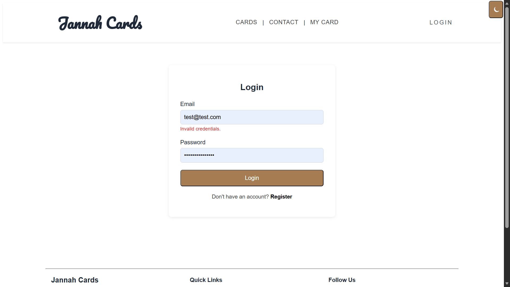
Incorrect login.

### Register

Functioning registration page.

### Contact Us
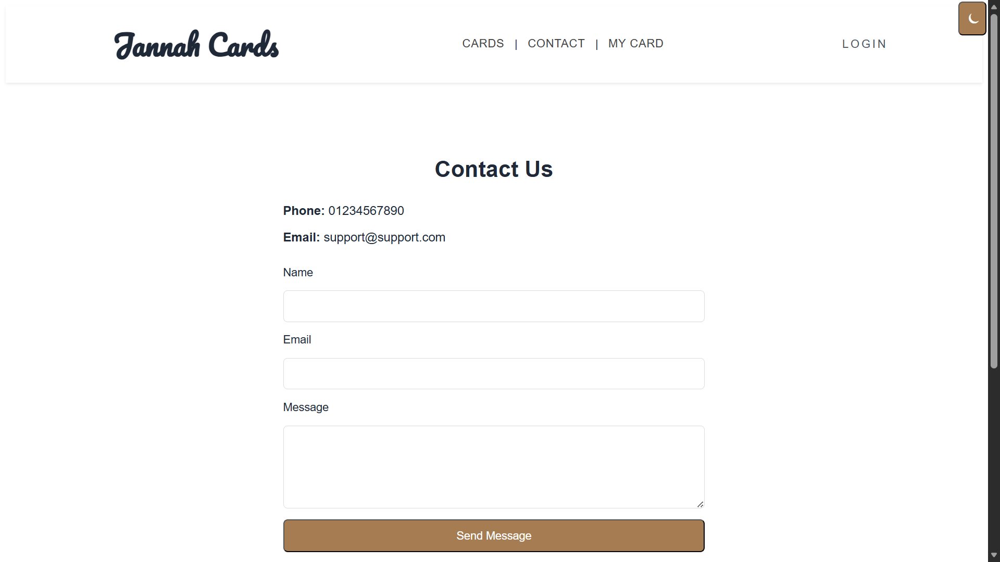
Contact page - light version.
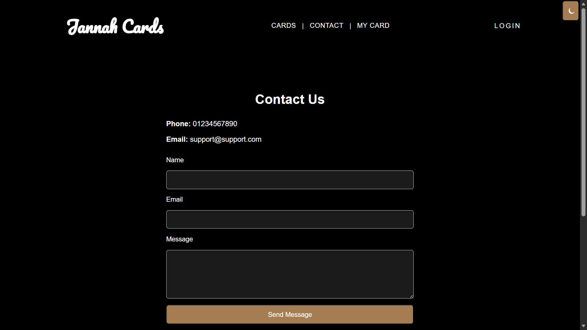
Contact page - dark version.

---
## Tech Stack

- **Laravel 10**
- **Fabric.js**
- **TailwindCSS**
- **MySQL**
- **Docker**
- **GitHub Actions (CI)**

---

## About Laravel

Laravel is a web application framework with expressive, elegant syntax. We believe development must be an enjoyable and creative experience to be truly fulfilling. Laravel takes the pain out of development by easing common tasks used in many web projects, such as:

- [Simple, fast routing engine](https://laravel.com/docs/routing).
- [Powerful dependency injection container](https://laravel.com/docs/container).
- Multiple back-ends for [session](https://laravel.com/docs/session) and [cache](https://laravel.com/docs/cache) storage.
- Expressive, intuitive [database ORM](https://laravel.com/docs/eloquent).
- Database agnostic [schema migrations](https://laravel.com/docs/migrations).
- [Robust background job processing](https://laravel.com/docs/queues).
- [Real-time event broadcasting](https://laravel.com/docs/broadcasting).

Laravel is accessible, powerful, and provides tools required for large, robust applications.
